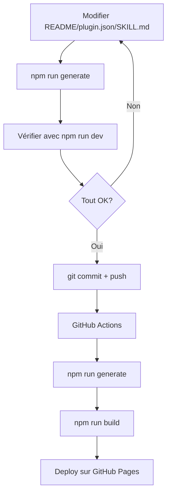

# Guide de Contribution

Ce guide explique comment contribuer au marketplace et comment la documentation est générée automatiquement.

## 🔄 Génération automatique de la documentation

La documentation VitePress est **générée automatiquement** depuis les plugins existants. Pas besoin de modifier manuellement les fichiers dans `docs/plugins/` !

### Fichiers sources

Le script de génération (`scripts/generate-docs.ts`) utilise :

| Source | Destination | Contenu généré |
|--------|-------------|----------------|
| `*/README.md` | `docs/plugins/*.md` | Page complète du plugin |
| `*/.claude-plugin/plugin.json` | Frontmatter YAML | Métadonnées (titre, version, description) |
| `*/skills/*/SKILL.md` | `docs/commands/index.md` | Index des 70 commandes |

### Transformations automatiques

Le script effectue plusieurs transformations :

1. **Liens internes** : Convertis en liens VitePress
   - `../git/README.md` → `/plugins/git`
   - `./skills/branch/SKILL.md` → `#branch`

2. **Frontmatter YAML** : Généré automatiquement
   ```yaml
   ---
   title: "Git Plugin"
   description: "Automatise branches, commits, PR"
   version: "2.1.0"
   ---
   ```

3. **Badges** : Ajoutés automatiquement
   - Badge de version depuis `plugin.json`
   - GitHub Actions badges supprimés

4. **Liens cassés** : Nettoyés
   - `MODELS.md`, `CHANGELOG.md` → Texte simple

## ➕ Ajouter un nouveau plugin

### 1. Créer la structure du plugin

```bash
# Créer le dossier
mkdir mon-plugin
cd mon-plugin

# Structure minimale requise
mkdir -p .claude-plugin skills
```

### 2. Créer le plugin.json

Fichier `.claude-plugin/plugin.json` :

```json
{
  "name": "Mon Plugin",
  "version": "1.0.0",
  "description": "Description courte du plugin",
  "author": {
    "name": "Ton Nom",
    "email": "ton@email.com"
  },
  "keywords": ["tag1", "tag2"]
}
```

### 3. Créer le README

Fichier `README.md` dans le plugin :

```markdown
# Mon Plugin

Description détaillée du plugin.

## Installation

\```bash
/plugin install mon-plugin@atournayre
\```

## Utilisation

### Commande 1

Description...

### Commande 2

Description...

## Configuration

...
```

**Important** :
- ✅ Utilise des liens relatifs vers d'autres plugins : `../git/README.md`
- ✅ Référence les skills du même plugin : `./skills/ma-skill/SKILL.md`
- ❌ N'utilise PAS de liens vers `MODELS.md`, `CHANGELOG.md` (ils seront supprimés)

### 4. Ajouter des skills (optionnel)

Créer `skills/ma-skill/SKILL.md` :

```yaml
---
name: mon-plugin:ma-skill
description: Description de la skill
---

# Prompt de la skill

Instructions pour Claude...
```

### 5. Générer la documentation

```bash
cd docs
npm run generate
```

Cela va créer automatiquement :
- `docs/plugins/mon-plugin.md`
- Mise à jour de `docs/commands/index.md` (si des skills)
- Mise à jour de `docs/plugins/index.md`

### 6. Vérifier le résultat

```bash
npm run dev
# Ouvrir http://localhost:5173/claude-marketplace/
```

Vérifie :
- [ ] La page `/plugins/mon-plugin` s'affiche correctement
- [ ] Les liens internes fonctionnent
- [ ] Les métadonnées (version, description) sont correctes
- [ ] Les commandes apparaissent dans `/commands/`

### 7. Commiter et déployer

```bash
git add mon-plugin/ docs/
git commit -m "feat: add mon-plugin"
git push origin main
```

GitHub Actions va automatiquement :
1. Générer la doc (`npm run generate`)
2. Builder VitePress (`npm run build`)
3. Déployer sur GitHub Pages

## ✏️ Modifier un plugin existant

### Modifier le README

1. Édite le fichier `ton-plugin/README.md`
2. Régénère la doc :
   ```bash
   cd docs
   npm run generate
   ```
3. Vérifie le résultat :
   ```bash
   npm run dev
   ```
4. Commit :
   ```bash
   git add ton-plugin/README.md docs/plugins/ton-plugin.md
   git commit -m "docs: update ton-plugin documentation"
   git push
   ```

### Modifier les métadonnées

1. Édite `.claude-plugin/plugin.json`
2. Régénère pour mettre à jour le frontmatter :
   ```bash
   cd docs
   npm run generate
   ```

### Ajouter une skill

1. Crée `skills/nouvelle-skill/SKILL.md`
2. Régénère pour mettre à jour l'index des commandes :
   ```bash
   cd docs
   npm run generate
   ```

## 🔍 Fichiers à ne PAS modifier manuellement

Ces fichiers sont **générés automatiquement** et seront écrasés :

- ❌ `docs/plugins/*.md` (sauf `index.md` et `by-category.md`)
- ❌ `docs/commands/index.md`

À la place, modifie les sources :
- ✅ `*/README.md`
- ✅ `*/.claude-plugin/plugin.json`
- ✅ `*/skills/*/SKILL.md`

## 🛠️ Comprendre le script de génération

Le script `scripts/generate-docs.ts` contient 3 fonctions principales :

### `copyPluginReadmes()`
- Scanne tous les dossiers avec `.claude-plugin/plugin.json`
- Lit chaque `README.md`
- Transforme les liens et ajoute le frontmatter
- Écrit dans `docs/plugins/{nom-plugin}.md`

### `generateCommandsIndex()`
- Scanne tous les `*/skills/*/SKILL.md`
- Parse le frontmatter YAML de chaque skill
- Génère la table markdown dans `docs/commands/index.md`

### `generatePluginIndex()`
- Génère `docs/plugins/index.md` avec composant Vue
- Utilise le data loader pour afficher les métadonnées dynamiques

## 🐛 Dépannage

### Les liens sont cassés après génération

**Problème** : Les liens relatifs ne pointent pas vers les bonnes pages.

**Solution** : Utilise le format correct dans le README :
- Vers autre plugin : `../nom-plugin/README.md`
- Vers skill du même plugin : `./skills/nom-skill/SKILL.md`

### Les commandes n'apparaissent pas dans l'index

**Problème** : Tes skills ne sont pas listées dans `/commands/`.

**Solution** : Vérifie que :
- Le fichier se nomme exactement `SKILL.md`
- Il est dans `skills/{nom}/SKILL.md`
- Le frontmatter YAML contient `name:` et `description:`

### Le build échoue avec "dead link"

**Problème** : VitePress détecte des liens cassés.

**Solution** : Le script devrait normalement les nettoyer. Si ça persiste :
1. Vérifie `docs/plugins/{ton-plugin}.md` manuellement
2. Cherche les liens vers `MODELS.md`, `CHANGELOG.md`, etc.
3. Mets à jour la regex dans `scripts/generate-docs.ts`

### Les métadonnées sont incorrectes

**Problème** : Version/description/auteur incorrect sur la page.

**Solution** : Vérifie `.claude-plugin/plugin.json` et régénère :
```bash
cd docs
npm run generate
npm run build
```

## 📝 Checklist avant de pusher

- [ ] `npm run generate` exécuté
- [ ] `npm run build` réussit sans erreur
- [ ] `npm run dev` affiche correctement le site
- [ ] Tous les liens internes fonctionnent
- [ ] Les métadonnées sont correctes
- [ ] Pas de liens cassés ("dead link")
- [ ] Les commandes apparaissent dans `/commands/` (si skills ajoutées)

## 🚀 Workflow complet



## 💡 Bonnes pratiques

### README du plugin
- ✅ Structure claire avec titres H2/H3
- ✅ Exemples de code avec syntax highlighting
- ✅ Capture d'écran si pertinent (dans `assets/`)
- ✅ Section "Installation", "Utilisation", "Configuration"

### plugin.json
- ✅ Description courte (< 100 caractères)
- ✅ Keywords pertinents pour la recherche
- ✅ Version semver (1.0.0, 1.2.3, etc.)

### Skills
- ✅ Nom au format `plugin:skill` ou `plugin:namespace:skill`
- ✅ Description claire du comportement
- ✅ Prompt bien structuré

## 📚 Ressources

- [VitePress Documentation](https://vitepress.dev/)
- [Script de génération](../../scripts/generate-docs.ts)
- [Data loader](../.vitepress/data/plugins.data.ts)
- [Configuration VitePress](../.vitepress/config.ts)
