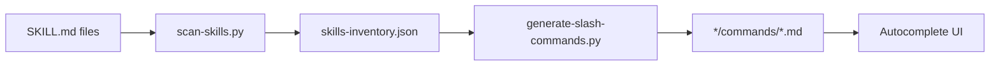

# Workaround : Slash Commands pour Skills

## Contexte

### Le problème

Claude Code a un bug connu (#15178) où les **plugin skills ne sont pas injectées dans le contexte `<available_skills>`**.

**Conséquences** :
- ❌ Les skills n'apparaissent pas dans l'autocomplete UI
- ❌ Claude ne peut pas les suggérer proactivement
- ⚠️ Les skills fonctionnent uniquement si invoquées manuellement (`/git:commit`)

**Références** :
- Issue principale : https://github.com/anthropics/claude-code/issues/15178
- Issues dupliquées : #9716, #14689, #16575, #17332, #18622, #19212, #20017

### La solution

Ce workaround génère automatiquement des **slash commands** (fichiers `.md` dans `<plugin>/commands/`) pour chaque skill du projet.

**Avantages** :
- ✅ Autocomplete UI fonctionnel
- ✅ Invocation directe : `/git:commit`, `/dev:feature`, etc.
- ✅ Préservation des `argument-hint`
- ✅ Génération automatique
- ✅ Synchronisation facile

## Architecture

### Scripts

```
scripts/
├── scan-skills.py              # Scanne tous les SKILL.md
├── generate-slash-commands.py  # Génère les .md pour chaque skill
├── sync-slash-commands.sh      # Synchronisation complète
└── skills-inventory.json       # Inventaire généré
```

### Workflow



### Fonctionnement

1. **scan-skills.py** :
   - Parcourt récursivement tous les `SKILL.md`
   - Parse le frontmatter YAML
   - Extrait : `name`, `description`, `argument-hint`, `allowed-tools`
   - Génère `skills-inventory.json`

2. **generate-slash-commands.py** :
   - Lit l'inventaire JSON
   - Crée un fichier `.md` par skill dans `<plugin>/commands/` avec sous-répertoires
   - Organisation par namespaces :
     - `git:commit` → `git/commands/commit.md` → `/git:commit`
     - `dev:auto:clarify` → `dev/commands/auto/clarify.md` → `/dev:clarify` (namespace: auto)
     - `framework:make:entity` → `framework/commands/make/entity.md` → `/framework:entity` (namespace: make)
   - Le fichier demande à Claude d'invoquer la skill correspondante avec son nom complet

3. **Invocation** :
   - L'utilisateur tape `/git:commit` ou `/dev:clarify` dans Claude Code
   - La slash command charge le prompt qui demande à Claude d'exécuter la skill
   - Claude utilise l'outil `Skill` pour invoquer la skill avec son nom complet (ex: `dev:auto:clarify`)

### Namespacing et sous-répertoires

Les skills multi-niveaux sont organisées en sous-répertoires :
- Les segments avant le dernier deviennent des sous-répertoires
- Le dernier segment devient le nom du fichier
- Le sous-répertoire apparaît dans la description de l'autocomplete

**Exemples** :
```
dev:auto:clarify
  ↓
dev/commands/auto/clarify.md
  ↓
/dev:clarify (description: "plugin:auto - Lever ambiguités...")

framework:make:entity
  ↓
framework/commands/make/entity.md
  ↓
/framework:entity (description: "plugin:make - Générer entité...")
```

**Collisions de noms** : Certaines skills créent des commandes avec le même nom mais dans des namespaces différents. Claude Code les distingue par la description dans l'autocomplete.

## Utilisation

### Test initial

1. **Redémarrer Claude Code** :
   ```bash
   # Quittez et relancez pour recharger les commandes
   claude
   ```

2. **Tester l'autocomplete** :
   ```bash
   # Dans la session interactive, tapez :
   > /
   # Vous devriez voir toutes les slash commands
   ```

3. **Exécuter une commande** :
   ```bash
   > /git:commit
   # La skill git:commit s'exécute
   ```

### Commandes disponibles

**Par plugin** :

| Plugin | Nombre | Exemples |
|--------|--------|----------|
| git | 8 | `/git:commit`, `/git:branch`, `/git:conflit` |
| dev | 23 | `/dev:feature`, `/dev:debug`, `/dev:review` |
| framework | 9 | `/framework:make:entity`, `/framework:make:factory` |
| doc | 4 | `/doc:adr`, `/doc:rtfm`, `/doc:update` |
| qa | 2 | `/elegant-objects`, `/phpstan-resolver` |
| ... | ... | ... |

**Total** : 69 slash commands générées

Voir la liste complète :
```bash
ls */commands/
```

### Synchronisation

Après avoir ajouté/modifié une skill :

```bash
# Méthode 1 : Script automatique
scripts/sync-slash-commands.sh

# Méthode 2 : Manuelle
python3 scripts/scan-skills.py
python3 scripts/generate-slash-commands.py
```

## Maintenance

### Ajouter une nouvelle skill

1. Créer le fichier `SKILL.md` dans le plugin approprié
2. Lancer la synchronisation :
   ```bash
   scripts/sync-slash-commands.sh
   ```
3. Commiter les changements :
   ```bash
   git add */commands/
   git commit -m "🔄 sync: régénérer slash commands"
   ```

### Hook git (optionnel)

Pour automatiser la synchronisation, vous pouvez créer un hook git :

```bash
# .git/hooks/pre-commit
#!/bin/bash
# Auto-sync slash commands si des skills ont changé

if git diff --cached --name-only | grep -q "SKILL.md$"; then
    echo "📝 Skills modifiées détectées, synchronisation..."
    scripts/sync-slash-commands.sh
    git add */commands/
fi
```

## Limitations

### Ce qui fonctionne

- ✅ Autocomplete UI
- ✅ Invocation manuelle
- ✅ Argument hints
- ✅ Namespacing (`:` dans les noms)

### Ce qui ne fonctionne pas

- ❌ Claude ne suggère pas automatiquement les skills (comme prévu)
- ⚠️ Nécessite une synchronisation manuelle après changement

### Différences avec les skills natives

| Aspect | Skills natives | Slash commands |
|--------|---------------|----------------|
| Autocomplete | ❌ (bug #15178) | ✅ |
| Invocation manuelle | ✅ | ✅ |
| Suggestion auto par Claude | ❌ (bug #15178) | ❌ |
| Argument hints | ✅ | ✅ |
| Hooks | ✅ | ❌ |

## Migration future

Une fois le bug #15178 résolu :

1. **Supprimer le workaround** :
   ```bash
   rm -rf */commands/
   rm scripts/scan-skills.py
   rm scripts/generate-slash-commands.py
   rm scripts/sync-slash-commands.sh
   rm scripts/skills-inventory.json
   ```

2. **Mettre à jour la documentation** :
   - Supprimer les références au workaround
   - Documenter l'utilisation native des skills

3. **Tester** :
   - Vérifier que l'autocomplete fonctionne nativement
   - Confirmer que Claude suggère les skills automatiquement

## Références

- **Bug principal** : https://github.com/anthropics/claude-code/issues/15178
- **Doc Skills** : https://code.claude.com/docs/en/skills
- **Doc Slash Commands** : https://code.claude.com/docs/en/slash-commands
- **Plugin system** : https://code.claude.com/docs/en/plugins

---

**Créé le** : 2026-01-25
**Dernière mise à jour** : 2026-01-25
**Statut** : Actif (en attente de fix #15178)
